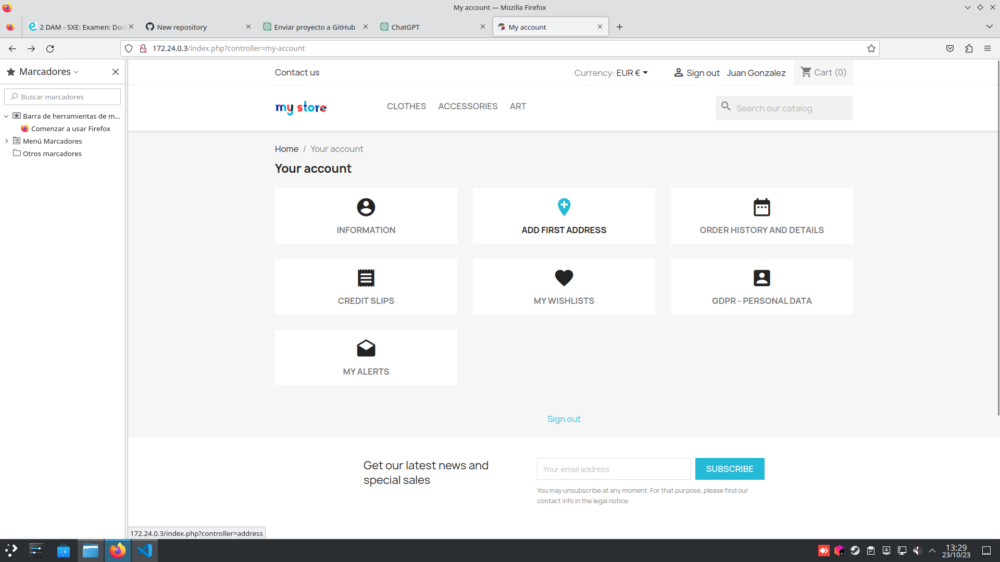

# Configuración de PrestaShop con Docker

Este README te guiará a través de los pasos para configurar un entorno de desarrollo de PrestaShop utilizando Docker. Usaremos Docker Compose para simplificar el proceso.

## Requisitos Previos

Asegúrate de tener instalado lo siguiente en tu máquina:

- [Docker](https://docs.docker.com/get-docker/)
- [Docker Compose](https://docs.docker.com/compose/install/)

## Paso 1: Crear un Directorio de Trabajo

Abre tu terminal y crea un directorio donde almacenarás los archivos de configuración y datos de PrestaShop. Puedes nombrarlo como quieras.

```bash
mkdir prestashop
cd prestashop
```
## Paso 2: Creamos el archivo 'docker-compose.yml'

Dentro del directorio creamos un archivo 'docker-compose.yml' con un editor de texto y copiamos el siguinete texto.

```bash
version: '3'
services:
  prestashop:
    image: prestashop/prestashop
    ports:
      - "8080:80"
    volumes:
      - ./prestashop:/var/www/html
    environment:
      - PS_INSTALL_AUTO=1
      - DB_SERVER=prestashop-db
      - DB_NAME=prestashop
      - DB_USER=prestashop
      - DB_PASSWD=prestashop
    depends_on:
      - prestashop-db

  prestashop-db:
    image: mysql:5.7
    environment:
      - MYSQL_ROOT_PASSWORD=prestashop
      - MYSQL_DATABASE=prestashop
      - MYSQL_USER=prestashop
      - MYSQL_PASSWORD=prestashop
```

### Ahora explicaré mas o menos el contenido del archivo docker-compose.yml:

1. Esta línea define la versión de Docker Compose que se va a utilizar. En este caso, se está utilizando la versión 3.

```bash
   version:'3'
```

2. Comienza la definición de servicios. Aquí se especifica cada contenedor que se ejecutará como parte de tu aplicación.

```bash
   services
```

3. Define un servicio llamado "prestashop". Este servicio utiliza la imagen de PrestaShop oficial de Docker Hub.

```bash
   prestashop:
```
4. Especifica la imagen de Docker que se utilizará para este servicio. En este caso, se está utilizando la imagen oficial de PrestaShop.
```bash
  image: prestashop/prestashop
```
5. Define una asignación de puertos para el contenedor. Esto significa que el puerto 8080 de tu máquina local se mapeará al puerto 80 del contenedor PrestaShop. Puedes acceder a PrestaShop a través de http://localhost:8080 en tu navegador.
```bash
   ports:
      - "8080:80"
```
6. Establece un volumen que enlaza una carpeta local ./prestashop con el directorio /var/www/html en el contenedor PrestaShop. Esto permite que los archivos de PrestaShop sean persistentes en tu máquina local, incluso si el contenedor se detiene.
```bash
      volumes:
      - ./prestashop:/var/www/html
```

7. Estas variables de entorno se utilizan para configurar PrestaShop durante la instalación inicial.

```bash
         environment:
      - PS_INSTALL_AUTO=1 
      - DB_SERVER=prestashop-db
      - DB_NAME=prestashop
      - DB_USER=prestashop
      - DB_PASSWD=prestashop
```

+ PS_INSTALL_AUTO=1: Esto le dice a PrestaShop que realice una instalación automática

+ DB_SERVER=prestashop-db: Indica que la base de datos de PrestaShop se encuentra en el servicio prestashop-db

+ DB_NAME=prestashop: Nombre de la base de datos.

+ DB_USER=prestashop: Nombre de usuario de la base de datos.

+ DB_PASSWD=prestashop: Contraseña de la base de datos


8. depends_on: Esto asegura que el servicio PrestaShop se inicie después de que el servicio PrestaShop-DB esté en funcionamiento. 

```bash
     depends_on:
      - prestashop-db   
```


## Paso 3: Ejecutamos docker-compose:

+ docker-compose up -d 

## Paso 4: Acceder a PrestaShop

Abre tu navegador web y visita http://localhost:8080. Esto te llevará a la configuración inicial de PrestaShop.


## Paso 5. Captura dentro de la Página:




